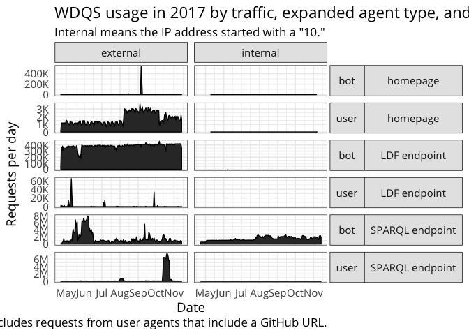
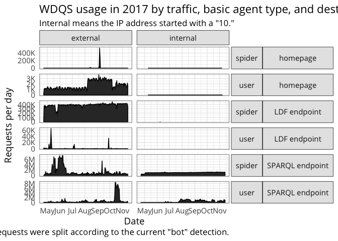
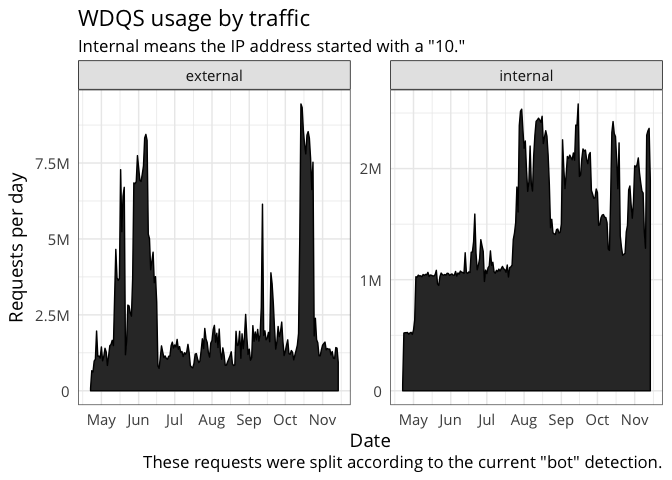
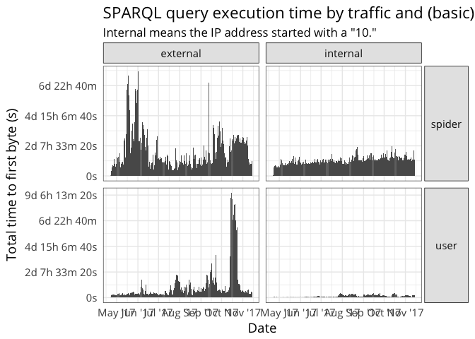
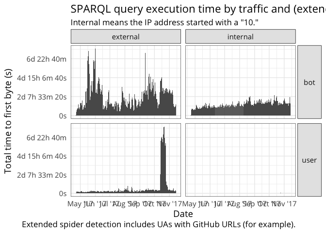

This shows a breakdown of internal vs external WDQS usage for
Phabricator task [T179850](https://phabricator.wikimedia.org/T179850).

Per-second traffic/usage
------------------------

Most of the time there are fewer than 100 internal requests per second
to the SPARQL endpoint. External usage of SPARQL endpoint varies
considerably, with as many as 500 reqs/sec observed during one hour on
October 14th.

Daily traffic/usage
-------------------

In general we get quite a bit of external traffic from bots to the
SPARQL endpoint:

### Requests

### Time to first byte (TTFB)

